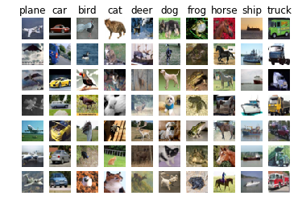
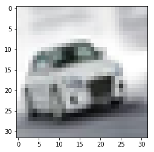
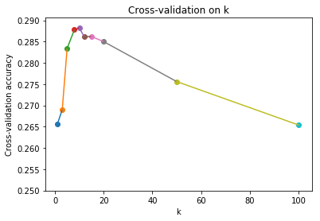
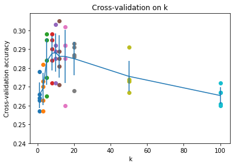

## k-Nearest Neighbor (kNN) exercise
The kNN classifier consists of two stages:

- During training, the classifier takes the training data and simply remembers it
- During testing, kNN classifies every test image by comparing to all training images and transfering the labels of the k most similar training examples
- The value of k is cross-validated

In this exercise you will implement these steps and understand the basic Image Classification pipeline, cross-validation, and gain proficiency in writing efficient, vectorized code.


```python
import random
import numpy as np
from DSVC.data_utils import load_CIFAR10
import matplotlib.pyplot as plt

# This is a bit of magic to make matplotlib figures appear inline in the notebook
# rather than in a new window.
%matplotlib inline
plt.rcParams['figure.figsize'] = (15., 12.) # set default size of plots
plt.rcParams['image.interpolation'] = 'nearest'
plt.rcParams['image.cmap'] = 'gray'

# Some more magic so that the notebook will reload external python modules;
%load_ext autoreload
%autoreload 2
```


```python
# Load the raw CIFAR-10 data.
cifar10_dir = 'DSVC/datasets/cifar-10-batches-py' # you should change it to your own path, 
                                                    # or put the dataset to this path


# To avoid some memory problem, we load 3 batch of the data(30000 images).
# You can change the number '3' to '6' to load the hole dataset(60000 images).
X_train, y_train, X_test, y_test = load_CIFAR10(cifar10_dir, 3)

# As a sanity check, we print out the size of the training and test data.
print ('Training data shape: ', X_train.shape)
print ('Training labels shape: ', y_train.shape)
print ('Test data shape: ', X_test.shape)
print ('Test labels shape: ', y_test.shape)
```

    Training data shape:  (20000, 32, 32, 3)
    Training labels shape:  (20000,)
    Test data shape:  (10000, 32, 32, 3)
    Test labels shape:  (10000,)
    


```python
X_train[1,:]
```


    array([[[154., 177., 187.],
            [126., 137., 136.],
            [105., 104.,  95.],
            ...,
            [ 91.,  95.,  71.],
            [ 87.,  90.,  71.],
            [ 79.,  81.,  70.]],
    
           [[140., 160., 169.],
            [145., 153., 154.],
            [125., 125., 118.],
            ...,
            [ 96.,  99.,  78.],
            [ 77.,  80.,  62.],
            [ 71.,  73.,  61.]],
    
           [[140., 155., 164.],
            [139., 146., 149.],
            [115., 115., 112.],
            ...,
            [ 79.,  82.,  64.],
            [ 68.,  70.,  55.],
            [ 67.,  69.,  55.]],
    
           ...,
    
           [[175., 167., 166.],
            [156., 154., 160.],
            [154., 160., 170.],
            ...,
            [ 42.,  34.,  36.],
            [ 61.,  53.,  57.],
            [ 93.,  83.,  91.]],
    
           [[165., 154., 128.],
            [156., 152., 130.],
            [159., 161., 142.],
            ...,
            [103.,  93.,  96.],
            [123., 114., 120.],
            [131., 121., 131.]],
    
           [[163., 148., 120.],
            [158., 148., 122.],
            [163., 156., 133.],
            ...,
            [143., 133., 139.],
            [143., 134., 142.],
            [143., 133., 144.]]])


```python
X_train.shape # 5000张图片，每张图片为32×32像素  每个像素占用3个像素点
```


    (20000, 32, 32, 3)


```python
y_train.shape
```


    (20000,)


```python
# Visualize some examples from the dataset.
# We show a few examples of training images from each class.
classes = ['plane', 'car', 'bird', 'cat', 'deer', 'dog', 'frog', 'horse', 'ship', 'truck']
num_classes = len(classes) # 10
samples_per_class = 7
for y, cls in enumerate(classes): # 返回索引跟索引值
    idxs = np.flatnonzero(y_train == y)  # 返回y_train元组中，值为y的下标
    idxs = np.random.choice(idxs,samples_per_class,replace=False) # 从idxs中随机取出不重复的size=7的不重复的，把每一行idex打乱
    for i,idx in enumerate(idxs):
        plt_idx = i * num_classes + y + 1 # 换算成二维坐标所对应的一维数据
        plt.subplot(samples_per_class, num_classes, plt_idx) # 指定区域大小以及当前的绘图位置
        plt.imshow(X_train[idx].astype('uint8'))
        plt.axis('off')  # 关闭坐标轴
        if i == 0: # 每列的的第一行添加title
            plt.title(cls) 
plt.show()
```





```python
# Subsample the data for more efficient code execution in this exercise
num_training = 5000 # Take the first 1500 pieces of data
mask = range(num_training)
X_train = X_train[mask]
y_train = y_train[mask]

# test datasets
num_test = 500
mask = range(num_test) # Take the first 500 pieces of data
X_test = X_test[mask]
y_test = y_test[mask]
```


```python
print(X_train.shape)
print(X_test.shape)
```

    (5000, 32, 32, 3)
    (500, 32, 32, 3)
    


```python
plt.imshow(X_train[119].astype('uint8'))
plt.show()
```





```python
X_train.shape
```


    (5000, 32, 32, 3)


```python
X_train = np.reshape(X_train,(X_train.shape[0],-1)) # 将图片的数据转为二维的数据
X_test = np.reshape(X_test, (X_test.shape[0], -1))
print(X_train.shape,X_test.shape)
```

    (5000, 3072) (500, 3072)
    


```python
from DSVC.classifiers.k_nearest_neighbor import KNearestNeighbor
classifier = KNearestNeighbor()
```


```python
classifier.train(X_train,y_train)
```


```python
print(X_test)
print(X_test.shape)
print(X_train)
print(X_train.shape)
```

    [[158. 112.  49. ...  21.  67. 110.]
     [235. 235. 235. ... 186. 200. 199.]
     [158. 190. 222. ...   7.   8.   7.]
     ...
     [ 74. 126. 176. ... 141. 199. 251.]
     [145. 162. 125. ... 117. 119. 105.]
     [185. 189. 188. ... 211. 212. 206.]]
    (500, 3072)
    [[ 59.  62.  63. ... 123.  92.  72.]
     [154. 177. 187. ... 143. 133. 144.]
     [255. 255. 255. ...  80.  86.  84.]
     ...
     [167. 163. 145. ...  42.  78.  84.]
     [154. 152. 125. ... 194. 247. 114.]
     [ 45.  32.  21. ... 156. 142. 100.]]
    (5000, 3072)
    


```python
# compute_distances_two_loops.
# Test my implementation.
%time dists = classifier.compute_distances_two_loops(X_test)
print(dists.shape)
# print(dicts)
```

    Wall time: 41.5 s
    (500, 5000)
    


```python
# compute_distances_one_loops.
# Test my implementation.
%time dists = classifier.compute_distances_one_loop(X_test)
print(dists.shape)
# print(dicts)
```

    Wall time: 1min 32s
    (500, 5000)
    

假设现在有两个矩阵 $A = \left[\begin{matrix} a_{11} & a_{12} \cr a_{21} & a_{22} \end{matrix}\right]_{2×2}, B = \left[\begin{matrix}b_{11} & b_{12} \cr b_{21} & b_{22} \cr b_{31} & b_{32} \end{matrix}\right]_{3×2}$ ，我们的目的是为了得到

距离矩阵 $C = \left[\begin{matrix} \sqrt{(a_{11} - b_{11})^2 + (a_{12} - b_{12})^2} & \sqrt{(a_{11} - b_{21})^2 + (a_{12} - b_{22})^2} & \sqrt{(a_{11} - b_{31})^2 + (a_{12} - b_{32})^2} \cr \sqrt{(a_{21} - b_{11})^2 + (a_{22} - b_{12})^2} & \sqrt{(a_{21} - b_{21})^2 + (a_{22} - b_{22})^2} & \sqrt{(a_{21} - b_{31})^2 + (a_{22} - b_{32})^2} \end{matrix}\right]_{2×3}$

$ C_0 = C^2 = \left[\begin{matrix} (a_{11} - b_{11})^2 + (a_{12} - b_{12})^2 & (a_{11} - b_{21})^2 + (a_{12} - b_{22})^2 & (a_{11} - b_{31})^2 + (a_{12} - b_{32})^2 \cr (a_{21} - b_{11})^2 + (a_{22} - b_{12})^2 & (a_{21} - b_{21})^2 + (a_{22} - b_{22})^2 & (a_{21} - b_{31})^2 + (a_{22} - b_{32})^2 \end{matrix}\right]_{2×3}$

$= \left[\begin{matrix} a_{11}^2 - 2a_{11}b_{11} + b_{11}^2 + a_{12}^2 - 2a_{12}b_{12} + b_{12}^2 & a_{11}^2 - 2a_{11}b_{21} + b_{21}^2 + a_{12}^2 - 2a_{12}b_{22} + b_{22}^2 & a_{11}^2 - 2a_{11}b_{31} + b_{31}^2 + a_{12}^2 - 2a_{12}b_{32} + b_{32}^2 \cr  a_{21}^2 - 2a_{21}b_{11} + b_{11}^2 + a_{22}^2 - 2a_{22}b_{12} + b_{12}^2 & a_{21}^2 - 2a_{21}b_{21} + b_{21}^2 + a_{22}^2 - 2a_{22}b_{22} + b_{22}^2 & a_{21}^2 - 2a_{21}b_{31} + b_{31}^2 + a_{22}^2 - 2a_{22}b_{32} + b_{32}^2 \end{matrix}\right]_{2×3}$

$= \left[\begin{matrix} a_{11}^2 + a_{12}^2 & a_{11}^2 + a_{12}^2 & a_{11}^2 + a_{12}^2 \cr a_{21}^2 + a_{22}^2  & a_{21}^2 + a_{22}^2  & a_{21}^2 + a_{22}^2\end{matrix}\right]_{2×3} + \left[\begin{matrix}-2a_{11}b_{11} - 2a_{12}b_{12} & -2a_{11}b_{21} - 2a_{12}b_{22} & -2a_{11}b_{31} - 2a_{12}b_{32} \cr -2a_{21}b_{11} - 2a_{22}b_{12} & -2a_{21}b_{21} - 2a_{22}b_{22} & -2a_{21}b_{31} - 2a_{22}b_{32}\end{matrix}\right]_{2×3} + \left[\begin{matrix}  b_{11}^2 + b_{12}^2 & b_{21}^2 + b_{22}^2  & b_{31}^2 + b_{32}^2 \cr b_{11}^2 + b_{12}^2 & b_{21}^2 + b_{22}^2  & b_{31}^2 + b_{32}^2 \end{matrix}\right]_{2×3}$

$= C_1 + C_2 + C_3$

## $C_1$

$A = \left[\begin{matrix} a_{11} & a_{12} \cr a_{21} & a_{22} \end{matrix}\right]_{2×2}$转为$C_3 = \left[\begin{matrix} a_{11}^2 + a_{12}^2 & a_{11}^2 + a_{12}^2 & a_{11}^2 + a_{12}^2 \cr a_{21}^2 + a_{22}^2  & a_{21}^2 + a_{22}^2  & a_{21}^2 + a_{22}^2\end{matrix}\right]_{2×3}$


```python
A = [[1,2],
    [3,4]]
A = np.sum(np.power(A,2),axis = 1) # 每一行向量相加
C = np.reshape(A,(-1,1)) # 行向量转为列向量
print("A:",A)
print("C:",C)
```

    A: [ 5 25]
    C: [[ 5]
     [25]]
    

$X + C_1 = \left[\begin{matrix} 1 & 2 & 3\cr 4 & 5 & 6 \end{matrix}\right] + \left[\begin{matrix} 5 & 5 & 5 \cr 25  & 25 & 25 \end{matrix}\right] = \left[\begin{matrix} 6 & 7 & 8\cr 29 & 30 & 31 \end{matrix}\right]$


```python
B = [[1,2,3],
    [4,5,6]]
D = B + C # 直接加到每一列上
print("D:",D)
```

    D: [[ 6  7  8]
     [29 30 31]]
    

<font size=5> `X_sum = np.sum(np.power(X,2),axis = 1)`</font><br />

$C_1 = $ <font size=5>`np.reshape(X_sum,(-1,1))`</font><br />

## $C_2$

由于$A\cdot B^T = \left[\begin{matrix} a_{11} & a_{12} \cr a_{21} & a_{22} \end{matrix}\right] \cdot \left[\begin{matrix}b_{11} & b_{21} & b_{31}\cr  b_{12} & b_{22} & b_{32} \end{matrix}\right]  = \left[\begin{matrix}a_{11}b_{11} + a_{12}b_{12} & a_{11}b_{21} + a_{12}b_{22} & a_{11}b_{31} + a_{12}b_{32} \cr a_{21}b_{11} + a_{22}b_{12} & a_{21}b_{21} + a_{22}b_{22} &  a_{21}b_{31} + a_{22}b_{32}\end{matrix}\right]_{2×3}$

所以$C_2 = -2 * A \cdot B^T = $ <font size=6> ```-2 * np.dot(X,self.X_train.T)``` </font><br />

## $C_3$

$ B = \left[\begin{matrix}b_{11} & b_{12} \cr b_{21} & b_{22} \cr b_{31} & b_{32} \end{matrix}\right]_{3×2}$转为$C_3 = \left[\begin{matrix}  b_{11}^2 + b_{12}^2 & b_{21}^2 + b_{22}^2  & b_{31}^2 + b_{32}^2 \cr b_{11}^2 + b_{12}^2 & b_{21}^2 + b_{22}^2  & b_{31}^2 + b_{32}^2 \end{matrix}\right]_{2×3}$


```python
X = [[1,2],
    [3,4],
    [5,6]]
X = np.sum(np.power(X,2),axis = 1) # 每一行向量相加
X
```


    array([ 5, 25, 61], dtype=int32)


$X + C_3 = \left[\begin{matrix} 1 & 2 & 3\cr 4 & 5 & 6 \end{matrix}\right] + \left[\begin{matrix} 5 & 25 & 61 \cr 5  & 25 & 61 \end{matrix}\right] = \left[\begin{matrix} 6 & 27 & 64\cr 9 & 30 & 67  \end{matrix}\right]$


```python
B = [[1,2,3],
    [4,5,6]]
C = B + X # 直接加到每一行上
C
```


    array([[ 6, 27, 64],
           [ 9, 30, 67]])


$C_3 = $ <font size=5>`np.sum(np.power(self.X_train,2),axis = 1)`</font><br />

### 综上所述 ， 可以写出利用矩阵乘法快速求得结果：

```python
X_sum = np.sum(np.power(X,2),axis = 1)
X_C_1 = np.reshape(X_sum,(-1,1))
X_C_2 = -2 * np.dot(X,self.X_train.T)
X_C_3 = np.sum(np.power(self.X_train,2),axis = 1)
X_C = np.sqrt(X_C_1 + X_C_2 + X_C_3)
```


```python
%time dists = classifier.compute_distances_no_loops(X_test)
print(dists.shape)
print(dists)
```

    Wall time: 1.09 s
    (500, 5000)
    [[3803.92350081 4210.59603857 5504.0544147  ... 4007.64756434
      4203.28086142 4354.20256764]
     [6336.83367306 5270.28006846 4040.63608854 ... 4829.15334194
      4694.09767687 7768.33347636]
     [5224.83913628 4250.64289255 3773.94581307 ... 3766.81549853
      4464.99921613 6353.57190878]
     ...
     [5366.93534524 5062.8772452  6361.85774755 ... 5126.56824786
      4537.30613911 5920.94156364]
     [3671.92919322 3858.60765044 4846.88157479 ... 3521.04515734
      3182.3673578  4448.65305458]
     [6960.92443573 6083.71366848 6338.13442584 ... 6083.55504619
      4128.24744898 8041.05223214]]
    

### Test


```python
a = ['a','a','a','b','b','e','e','a','c','c','c','c','c']
b = {}
# for x in a: # 计算次数 
#     b[x] = b.get(x,0) + 1
for x in a: # 计算次数
    if x in b:
        b[x] += 1
    else:
        b[x] = 1
common_label,common_value = max(b.items(),key=lambda item:item[1])
print(b)
print(common_label)
```

    {'a': 4, 'b': 2, 'e': 2, 'c': 5}
    c
    


```python
# Now implement the function predict_labels and run the code below:
# We use k = 1 (which is Nearest Neighbor).
y_test_pred = classifier.predict_labels(dists, k=1)

# Compute and print the fraction of correctly predicted examples
num_correct = np.sum(y_test_pred == y_test)
accuracy = float(num_correct) / num_test
print ('Got %d / %d correct => accuracy: %f' % (num_correct, num_test, accuracy))
```

    Got 137 / 500 correct => accuracy: 0.274000
    

You should expect to see approximately 27% accuracy. Now lets try out a larger k, say k = 5:


```python
y_test_pred = classifier.predict_labels(dists, k=5)
num_correct = np.sum(y_test_pred == y_test)
accuracy = float(num_correct) / num_test
print ('Got %d / %d correct => accuracy: %f' % (num_correct, num_test, accuracy))
```

    Got 145 / 500 correct => accuracy: 0.290000
    

You should expect to see a slightly better performance than with k = 1.


```python
# Now lets speed up distance matrix computation by using partial vectorization
# with one loop. Implement the function compute_distances_one_loop and run the
# code below:
dists_one = classifier.compute_distances_one_loop(X_test)

# To ensure that our vectorized implementation is correct, we make sure that it
# agrees with the naive implementation. There are many ways to decide whether
# two matrices are similar; one of the simplest is the Frobenius norm. In case
# you haven't seen it before, the Frobenius norm of two matrices is the square
# root of the squared sum of differences of all elements; in other words, reshape
# the matrices into vectors and compute the Euclidean distance between them.
difference = np.linalg.norm(dists - dists_one, ord='fro')
print ('Difference was: %f' % (difference, ))
if difference < 0.001:
    print ('Good! The distance matrices are the same')
else:
    print ('Uh-oh! The distance matrices are different')
```

    Difference was: 0.000000
    Good! The distance matrices are the same
    


```python
# Now implement the fully vectorized version inside compute_distances_two_loops
# and run the code
dists_two = classifier.compute_distances_two_loops(X_test)

# check that the distance matrix agrees with the one we computed before:
difference = np.linalg.norm(dists - dists_two, ord='fro')
print ('Difference was: %f' % (difference, ))
if difference < 0.001:
    print ('Good! The distance matrices are the same')
else:
    print ('Uh-oh! The distance matrices are different')
```

    Difference was: 0.000000
    Good! The distance matrices are the same
    


```python
# Let's compare how fast the implementations are
def time_function(f, *args):
    """
    Call a function f with args and return the time (in seconds) that it took to execute.
    """
    import time
    tic = time.time()
    f(*args)
    toc = time.time()
    return toc - tic

two_loop_time = time_function(classifier.compute_distances_two_loops, X_test)
print ('Two loop version took %f seconds' % two_loop_time)

one_loop_time = time_function(classifier.compute_distances_one_loop, X_test)
print ('One loop version took %f seconds' % one_loop_time)

no_loop_time = time_function(classifier.compute_distances_no_loops, X_test)
print ('No loop version took %f seconds' % no_loop_time)

# you should see significantly faster performance with the fully vectorized implementation
```

    Two loop version took 49.400868 seconds
    One loop version took 103.613396 seconds
    No loop version took 1.465172 seconds
    

### Cross-validation

We have implemented the k-Nearest Neighbor classifier but we set the value k = 5 arbitrarily. We will now determine the best value of this hyperparameter with cross-validation.

There are three kinds of validation methods(introduction to these methods). The method below is S-Folder Cross Validation. If it's difficult for you, use the simple cross-validation alternatively.


```python
num_folds = 5
k_choices = [1, 3, 5, 8, 10, 12, 15, 20, 50, 100]

X_train_folds = []
y_train_folds = []
################################################################################
# TODO:                                                                        #
# Split up the training data into folds. After splitting, X_train_folds and    #
# y_train_folds should each be lists of length num_folds, where                #
# y_train_folds[i] is the label vector for the points in X_train_folds[i].     #
# Hint: Look up the numpy array_split function.                                #
################################################################################
X_train_folds = np.array_split(X_train,num_folds) # 使用不重复抽样将X_train分为num_folds份
y_train_folds = np.array_split(y_train,num_folds) # 使用不重复抽样将y_train分为num_folds份
################################################################################
#                                 END OF YOUR CODE                             #
################################################################################

# A dictionary holding the accuracies for different values of k that we find
# when running cross-validation. After running cross-validation,
# k_to_accuracies[k] should be a list of length num_folds giving the different
# accuracy values that we found when using that value of k.
k_to_accuracies = {}
for k in k_choices: # 初始化字典
    k_to_accuracies[k] = []

################################################################################
# TODO:                                                                        #
# Perform k-fold cross validation to find the best value of k. For each        #
# possible value of k, run the k-nearest-neighbor algorithm num_folds times,   #
# where in each case you use all but one of the folds as training data and the #
# last fold as a validation set. Store the accuracies for all fold and all     #
# values of k in the k_to_accuracies dictionary.                               #
################################################################################
for k in k_choices: # 寻找最优的k
    for i in range(num_folds):  # 所采取的k折交叉验证  
        X_train_i = np.vstack(X_train_folds[:i] + X_train_folds[i+1:])  # 取出X_train_folds的非i份作为训练数据
        X_test_i = X_train_folds[i]  # 第i份作为测试数据
        
        y_train_i = np.hstack(y_train_folds[:i] + y_train_folds[i+1:])
        y_test_i = y_train_folds[i] 
        
        classifier.train(X_train_i,y_train_i) # 传入训练数据
        dists_test = classifier.compute_distances_no_loops(X_test_i) # 计算
        y_test_pred = classifier.predict_labels(dists_test,k)
        num_correct = np.sum(y_test_pred == y_test_i)
        accuracy = float(num_correct) / y_test_i.shape[0]
        k_to_accuracies[k].append(accuracy)
################################################################################
#                                 END OF YOUR CODE                             #
################################################################################

# Print out the computed accuracies
for k in sorted(k_to_accuracies):
    for accuracy in k_to_accuracies[k]:
        print ('k = %d, accuracy = %f' % (k,accuracy))
```

    k = 1, accuracy = 0.263000
    k = 1, accuracy = 0.257000
    k = 1, accuracy = 0.264000
    k = 1, accuracy = 0.278000
    k = 1, accuracy = 0.266000
    k = 3, accuracy = 0.257000
    k = 3, accuracy = 0.263000
    k = 3, accuracy = 0.273000
    k = 3, accuracy = 0.282000
    k = 3, accuracy = 0.270000
    k = 5, accuracy = 0.265000
    k = 5, accuracy = 0.275000
    k = 5, accuracy = 0.295000
    k = 5, accuracy = 0.298000
    k = 5, accuracy = 0.284000
    k = 8, accuracy = 0.272000
    k = 8, accuracy = 0.295000
    k = 8, accuracy = 0.284000
    k = 8, accuracy = 0.298000
    k = 8, accuracy = 0.290000
    k = 10, accuracy = 0.272000
    k = 10, accuracy = 0.303000
    k = 10, accuracy = 0.289000
    k = 10, accuracy = 0.292000
    k = 10, accuracy = 0.285000
    k = 12, accuracy = 0.271000
    k = 12, accuracy = 0.305000
    k = 12, accuracy = 0.285000
    k = 12, accuracy = 0.289000
    k = 12, accuracy = 0.281000
    k = 15, accuracy = 0.260000
    k = 15, accuracy = 0.302000
    k = 15, accuracy = 0.292000
    k = 15, accuracy = 0.292000
    k = 15, accuracy = 0.285000
    k = 20, accuracy = 0.268000
    k = 20, accuracy = 0.293000
    k = 20, accuracy = 0.291000
    k = 20, accuracy = 0.287000
    k = 20, accuracy = 0.286000
    k = 50, accuracy = 0.273000
    k = 50, accuracy = 0.291000
    k = 50, accuracy = 0.274000
    k = 50, accuracy = 0.267000
    k = 50, accuracy = 0.273000
    k = 100, accuracy = 0.261000
    k = 100, accuracy = 0.272000
    k = 100, accuracy = 0.267000
    k = 100, accuracy = 0.260000
    k = 100, accuracy = 0.267000
    


```python
print(X_train_folds[0].shape)
print(y_train_folds[0].shape)
```

    (1000, 3072)
    (1000,)
    


```python
k_to_accuracies
```


    {1: [0.263, 0.257, 0.264, 0.278, 0.266],
     3: [0.257, 0.263, 0.273, 0.282, 0.27],
     5: [0.265, 0.275, 0.295, 0.298, 0.284],
     8: [0.272, 0.295, 0.284, 0.298, 0.29],
     10: [0.272, 0.303, 0.289, 0.292, 0.285],
     12: [0.271, 0.305, 0.285, 0.289, 0.281],
     15: [0.26, 0.302, 0.292, 0.292, 0.285],
     20: [0.268, 0.293, 0.291, 0.287, 0.286],
     50: [0.273, 0.291, 0.274, 0.267, 0.273],
     100: [0.261, 0.272, 0.267, 0.26, 0.267]}


```python
# 平均准确度可视化
average_accuracy = 0
count = 0
for k in sorted(k_to_accuracies):
    for accuracy in k_to_accuracies[k]:
        average_accuracy += accuracy
        count += 1
    average_accuracy = average_accuracy / count
    plt.scatter(k,average_accuracy)
    plt.title('Cross-validation on k')
    plt.xlabel('k')
    plt.ylabel('Cross-validation accuracy')
    if k > 1:
        plt.plot([recent_k,k],[recent_accuracy,average_accuracy])
    recent_k = k
    recent_accuracy = average_accuracy
    average_accuracy = 0
    count = 0
plt.show()
```





```python
print(print)
```

    <built-in function print>
    


```python
# plot the raw observations
for k in k_choices:
    accuracies = k_to_accuracies[k]
    plt.scatter([k] * len(accuracies), accuracies)

# plot the trend line with error bars that correspond to standard deviation
accuracies_mean = np.array([np.mean(v) for k,v in sorted(k_to_accuracies.items())])
accuracies_std = np.array([np.std(v) for k,v in sorted(k_to_accuracies.items())])
plt.errorbar(k_choices, accuracies_mean, yerr=accuracies_std)
plt.title('Cross-validation on k')
plt.xlabel('k')
plt.ylabel('Cross-validation accuracy')
plt.show()
```





```python
# Based on the cross-validation results above, choose the best value for k,   
# retrain the classifier using all the training data, and test it on the test
# data. You should be able to get above 28% accuracy on the test data.
best_k = 8

classifier = KNearestNeighbor()
classifier.train(X_train, y_train)
y_test_pred = classifier.predict(X_test, k=best_k)

# Compute and display the accuracy
num_correct = np.sum(y_test_pred == y_test)
accuracy = float(num_correct) / num_test
print ('Got %d / %d correct => accuracy: %f' % (num_correct, num_test, accuracy))
```

    Got 147 / 500 correct => accuracy: 0.294000
    
